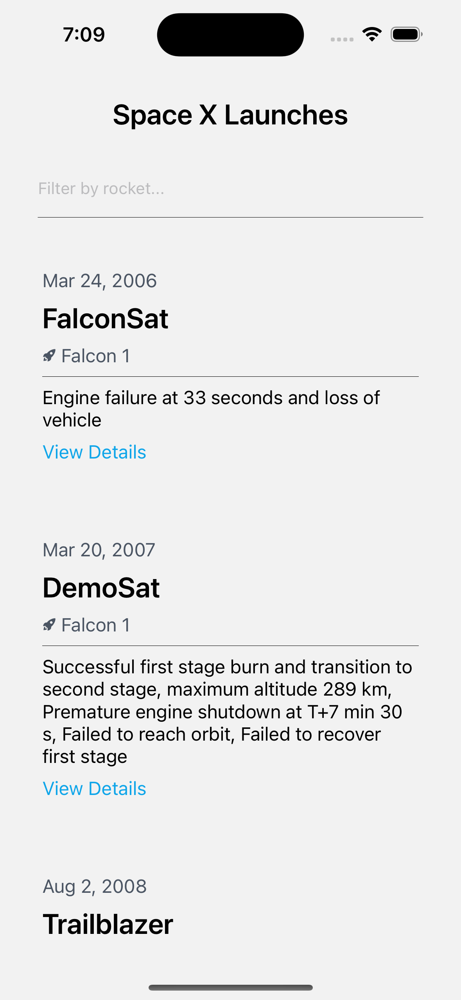
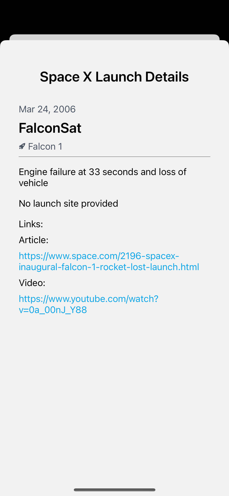
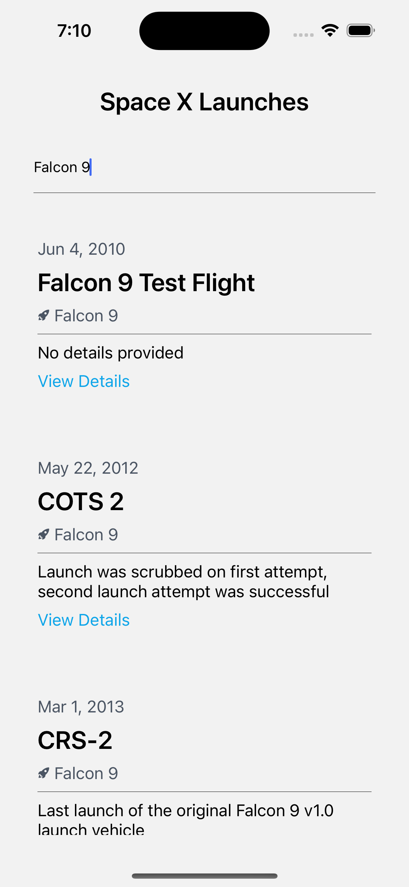

# React Native SpaceX App Demo

A React Native Expo demo app integrated with [SpaceX GraphQl public API](https://studio.apollographql.com/public/SpaceX-pxxbxen/variant/current/home) to display information about launches. This is an [Expo](https://expo.dev) project created with [`create-expo-app`](https://www.npmjs.com/package/create-expo-app).

## Screenshots

<div style="display: flex; flex-direction: 'row'; gap: 16px;">



</div>

## Features:

- [Expo Router](https://docs.expo.dev/routing/introduction/) file-based navigation
- State management and data fetching with [Apollo Client](https://github.com/apollographql/apollo-client)
- Home screen with SpaceX Launch information
- Details screen presented as a modal with detailed information
- Search bar to filter SpaceX Launch results

## Get started

1. Install dependencies

   ```bash
   npm install
   ```

2. Start the app

   ```bash
    npx expo start
   ```

In the output, you'll find options to open the app in a

- [development build](https://docs.expo.dev/develop/development-builds/introduction/)
- [Android emulator](https://docs.expo.dev/workflow/android-studio-emulator/)
- [iOS simulator](https://docs.expo.dev/workflow/ios-simulator/)
- [Expo Go](https://expo.dev/go), a limited sandbox for trying out app development with Expo
